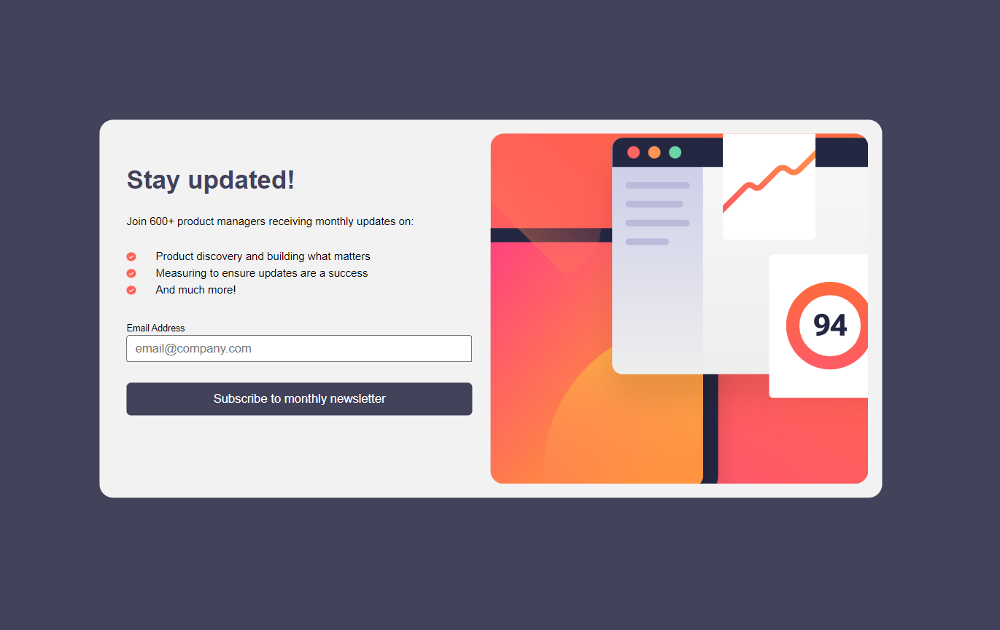

# Frontend Mentor - Newsletter sign-up form with success message solution

This is a solution to the [Newsletter sign-up form with success message challenge on Frontend Mentor](https://www.frontendmentor.io/challenges/newsletter-signup-form-with-success-message-3FC1AZbNrv). Frontend Mentor challenges help you improve your coding skills by building realistic projects. 

## Table of contents

- [Overview](#overview)
  - [The challenge](#the-challenge)
  - [Screenshot](#screenshot)
  - [Links](#links)
- [My process](#my-process)
  - [Built with](#built-with)
  - [What I learned](#what-i-learned)
  - [Useful resources](#useful-resources)
- [Author](#author)


## Overview

### The challenge

Users should be able to:

- Add their email and submit the form
- See a success message with their email after successfully submitting the form
- See form validation messages if:
  - The field is left empty
  - The email address is not formatted correctly
- View the optimal layout for the interface depending on their device's screen size
- See hover and focus states for all interactive elements on the page

### Screenshot



### Links

- Solution URL: [Replit](https://replit.com/@DeniseZitting/Newsletter-Sign-Up)
- Live Site URL: [Live URL](https://dzitting.github.io/front-end-mentor/newsletter/index.html)

## My process

I began with breaking down the design into possible HTML structures and deciding how they might interact with each other. I have created a modal of similar style so, I opted for the structure I was most familiar with. Which was to create a hole container `modal` and then two sub `div` halves that would each take 50% of the flex-box. Then style each half as if it were it's own piece.

Managing the negative space was a bit difficult and tedious, but I appreciated the challenge.

### Built with

- Semantic HTML5 markup
- CSS custom properties
- Flexbox

### What I learned

This project turned out to be more of a challenge than I expected. Mostly in terms of styling. That is where my skills lack the most!
However, I am proud of the turnout for the CSS here:
```css
@media (max-width: 600px) {
    section {
        flex-direction: column-reverse;
        height: 100vh;
        width: 60vw;
        border-radius: 0;
        padding: 0;
        margin: 0;
        justify-content: start;
    }
    ...
}
```

And all the following styling. Using `@media` was a bit new to me, but I enjoyed learning something new.

### Useful resources

- [Web Dev](https://web.dev/learn/css/transitions/) - This helped me working with the `transition` property in the CSS. For some reason, using `transition` alone was not creating the results I wanted. For instance: `transition: 300ms ease-in-out smooth` would not work as a smooth eased transition. So, I ended up working with individual properties.

## Author

- Website - [Denise Zitting](https://denisezitting.netlify.app/)
- Frontend Mentor - [@DeniseZitting](https://www.frontendmentor.io/profile/DeniseZitting)
